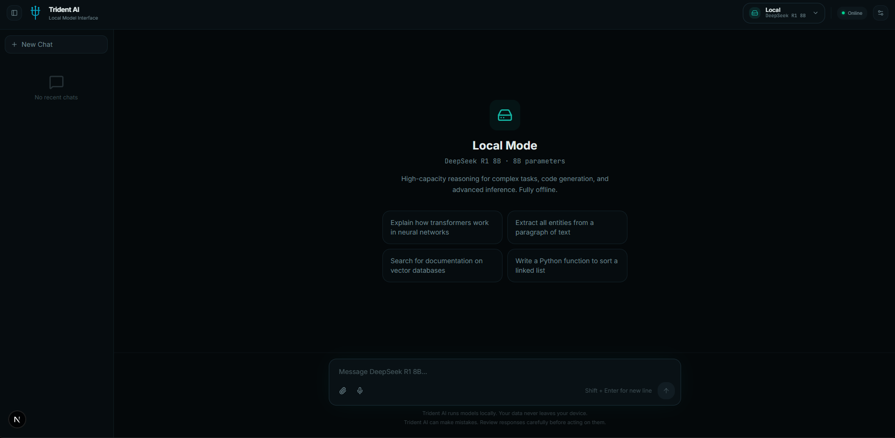

# 🔱 Trident-AI



# 🔱 Trident-AI

Sistema de búsqueda inteligente que corre modelos de IA localmente en GPU (AMD/NVIDIA) via Ollama. Sin APIs de pago para el core, sin datos que salgan de tu máquina.

## ¿Qué problema resuelve?

Los developers en Latinoamérica dependen de APIs de pago para hacer IA. Trident-AI corre completamente en tu hardware — 0 costos, 0 dependencias externas para el modo local.

## 3 Modos de Búsqueda

| Modo | Modelo | Uso |
|------|--------|-----|
| **Local** | DeepSeek R1 8B | Procesamiento pesado, razonamiento, datos que no deben salir a internet |
| **Entity** | Qwen 2.5 1.5B | Búsqueda de una sola entidad (personas, lugares, empresas) |
| **Search** | Qwen 2.5 7B | Búsqueda web generalizada desde múltiples fuentes |

## Stack

```
frontend-react/    → Next.js (puerto 3000)
backend-spring/    → Spring Boot — API Gateway único (puerto 8080)
backend-python/    → FastAPI + Ollama (puerto 8000)
```

## Decisiones de Arquitectura

- **Spring Boot como único gateway** — el frontend nunca llama directo a Python ni a APIs externas. Cambias de proveedor de IA sin tocar el cliente.
- **Un modelo activo a la vez** — decisión consciente por limitación de 8GB VRAM (RDNA3). UX sobre capacidad técnica.
- **SQLite para historial** — sin PostgreSQL en V1. Simple, sin infraestructura.
- **Respuestas siempre en español** — prompt base configurado en el cliente de Ollama.

## Estado

```
✅ Backend Python   → Completo y funcionando
🚧 Backend Spring  → En construcción
🚧 Frontend Next.js → Componentes creados, integración pendiente
```

## Roadmap

| Versión | Features |
|---------|----------|
| **V1** | Local + Entity + Search (actual) |
| **V2** | RAG con ChromaDB + Brave Search + Wikidata |
| **V3** | Pipelines + generación de documentos |
| **V4** | Benchmarks + MCP |

> **Nota:** Bing Entity/Search API se depreca en agosto 2025. V2 migra a Brave Search + Wikidata.

## Requisitos

- GPU AMD o NVIDIA con mínimo 8GB VRAM
- [Ollama](https://ollama.ai/) instalado
- Python 3.10+
- Java 21
- Node.js 20

## Modelos necesarios

```bash
ollama pull deepseek-r1:8b
ollama pull qwen2.5:1.5b
ollama pull qwen2.5:7b
```

## Instalación

```bash
# Backend Python
cd backend-python
pip install -r requirements.txt
uvicorn app.main:app --reload --port 8000

# Backend Spring (próximamente)
cd backend-spring
./mvnw spring-boot:run

# Frontend
cd frontend-react
npm install
npm run dev
```

## Variables de entorno

```env
OLLAMA_BASE_URL=http://localhost:11434
SERVICE_PORT=8000
BRAVE_SEARCH_API_KEY=tu_key  # Para modo Search (V2)
```

---

**Autor:** Luis Miguel Triana Rueda  
**Versión:** 1.0.0  
[](https://www.linkedin.com/in/luis-triana-2917202a2/)